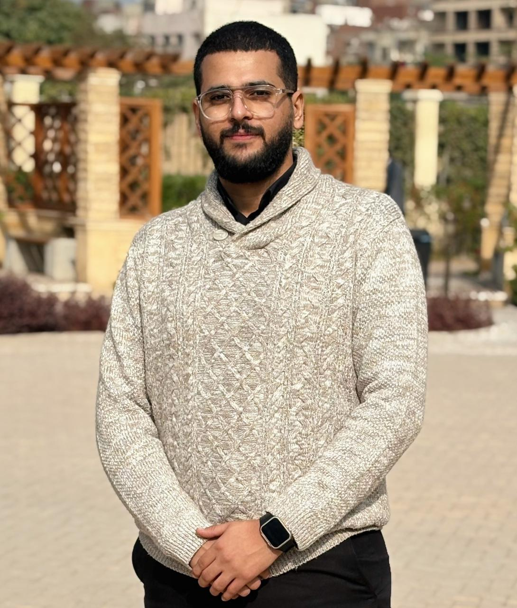

<!-- Animated Typing Header -->

### ITI Graduate - Intake 45 | Specialized in Embedded Systems & Android Automotive

  
  
  

---
 

## About Me

**Location:** Cairo, Egypt  
**Education:** ITI – Intake 45  
**Specialization:** Embedded Systems, Android Automotive  
**Focus:** Embedded Linux, AOSP(Android Open Source Project), In-Vehicle Infotainment Systems  

 

### What I Do

- Design and develop **real-time embedded systems**  
- Build **Android Automotive OS applications**  
- Design **mobile Android apps** using Java and Kotlin  
- Create **bare-metal firmware** for ARM architectures  
- Develop **custom Linux distributions** with Yocto  
- Implement **vehicle middleware** and communication protocols  

 

---

## Featured Project

### [PAO – Power Of Three](https://github.com/PAO-PowerOfThree)
**ITI Graduation Project | Multi-Domain Automotive Platform**

 

#### Key Achievements

| Domain | Technology | Implementation |
|--------|-----------|----------------|
| **Bare Metal** | ARM Cortex-M | Real-time sensor fusion & vehicle control |
| **Linux Stack** | Yocto + Qt | Custom middleware with modern UI/UX |
| **AAOS** | AOSP + Kotlin | Connected infotainment experience |

**Features:**  
IPC between Yocto and Android using vSOME/IP,  
Multi-display IVI setup with **1 Qt-based screen on Yocto** and **2 Android Automotive (AAOS) screens**,  
Real-time sharing of simulated vehicle signals across systems,  
Automotive-oriented system integration prototype.

---

## Technology Stack

### Core Competencies

<table>
<tr>
<td align="center" width="25%">
 
<b>Languages</b> 
C/C++ • Java • Kotlin
</td>
<td align="center" width="25%">
 
<b>Platforms</b> 
Linux • Qt • Android • AOSP
</td>
<td align="center" width="25%">
 
<b>Tools</b> 
Git • CMake • Bash • Vim
</td>
<td align="center" width="25%">
 
<b>IDEs & Tools</b> 
Docker • VS Code • Android Studio
</td>
</tr>
</table>

### Additional Development Tools

### Specialized Skills

---

## GitHub Analytics

## Let's Collaborate

### Open to opportunities in:

**Embedded Systems Engineering** | **Automotive Software Development**  
**Android Automotive OS** | **Android Mobile Application** | **Software Testing** | **IoT Solutions** | **System Architecture**

 

---
From [PatrickAtef8](https://github.com/PatrickAtef8) | **All Glory To God**

